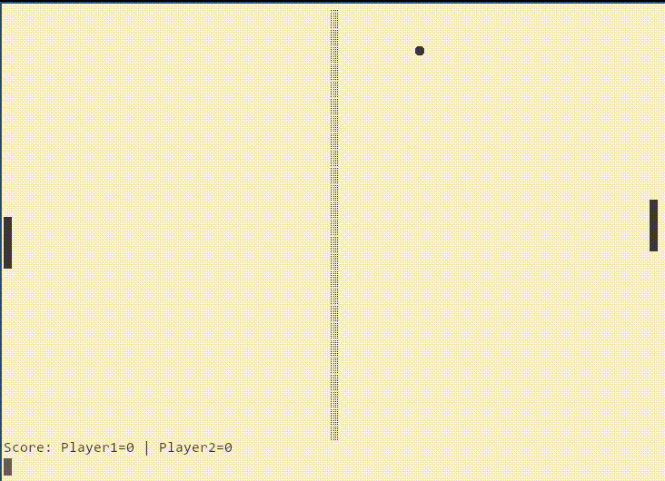

# 🏓 Pong 42 — Minimal Terminal Pong



**Pong 42** is a deliberately constrained implementation of the classic Pong game — written in C and playable in the terminal. The code follows a unique challenge: keep **every function under 42 characters** while using **only standard I/O** and **no dynamic memory, structs, or pointers**.

## 🎯 Features

- Pure ANSI C (C11 standard), no external libraries required  
- Terminal-based rendering using Unicode characters  
- Two-player real-time controls:
  - **Player 1:** `A` (up), `Z` (down)
  - **Player 2:** `K` (up), `M` (down)
- Minimalist code design:
  - ≤ 42 characters per function
  - No structs, malloc, `goto`, or `break/continue`
  - Single `return` statement

## 📦 Build Instructions

### 🛠 Requirements

- GCC or compatible C compiler
- Unix-like terminal with ANSI escape code support

### 🔧 To Build

```bash
make
```

### 🚀 To Run

```bash
make run
```

Or directly:

```bash
./build/pong_42
```

## 🧹 Other Make Targets

```bash
make clean     # Remove built binaries
make format    # Format all .c and .h files using clang-format
make analyze   # Run static analysis with cppcheck
```

## 🧠 Design Constraints

This version of Pong was designed under the following constraints:

1. Function length ≤ 42 characters  
2. Only `<stdio.h>` used  
3. No structs  
4. No dynamic memory allocation  
5. Only 1 return statement  
6. No `break`/`continue`  
7. No `goto`  
8. No pointers  

